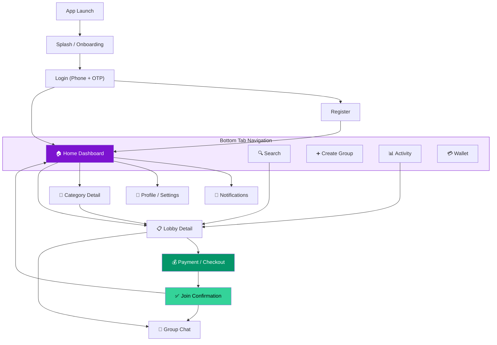
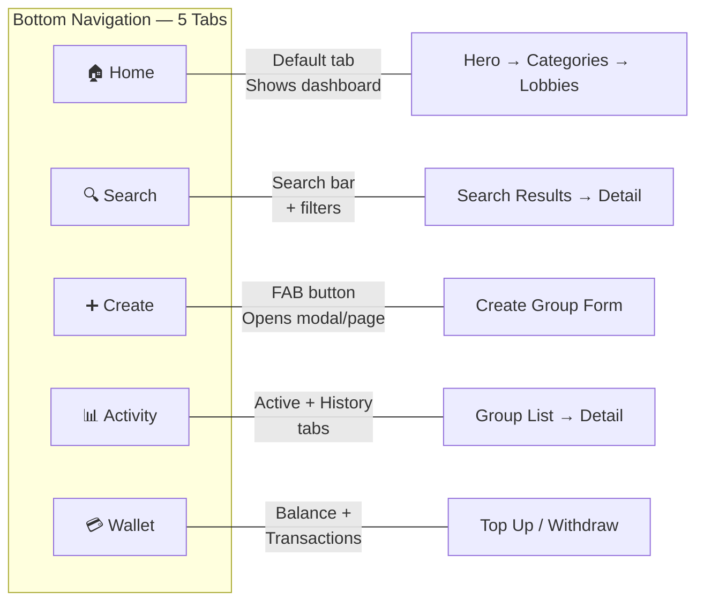
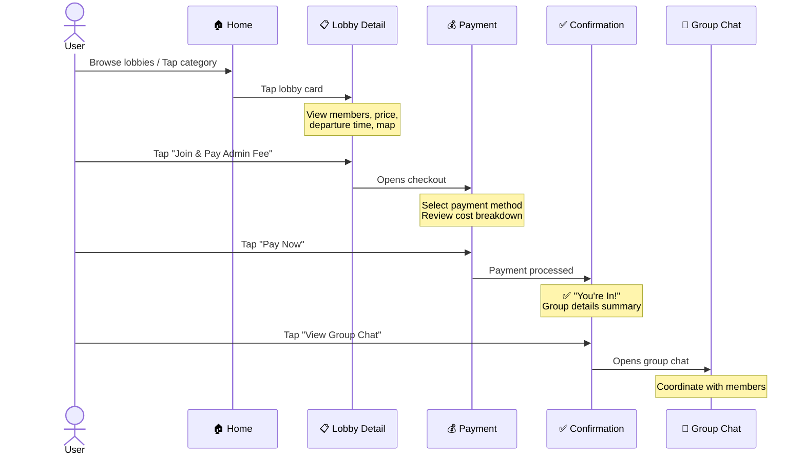
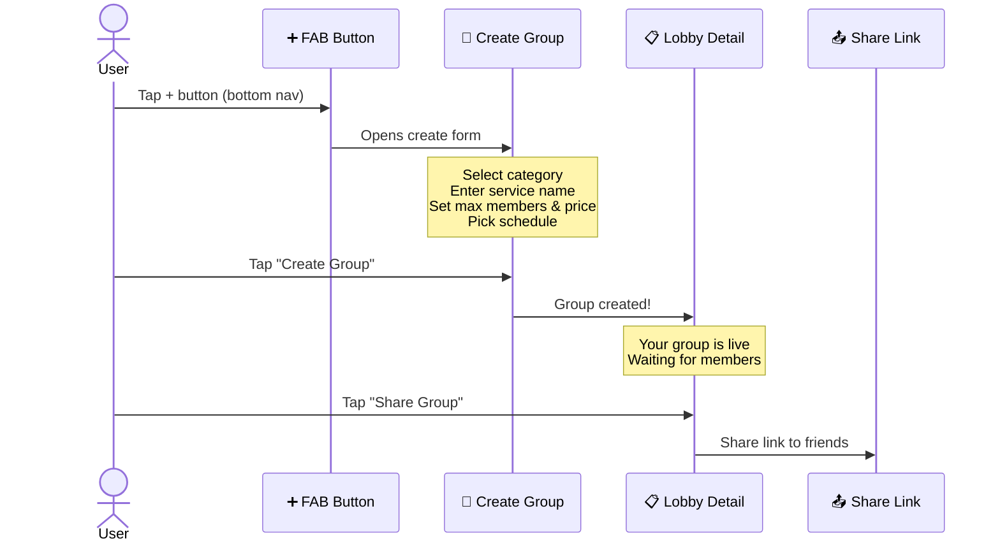
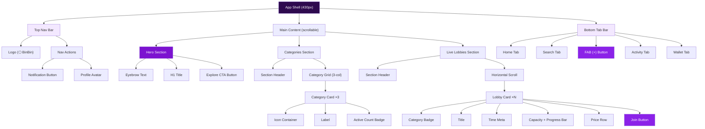
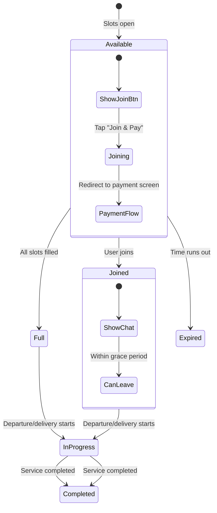

# BinBin — UI/UX Specification & Navigation Architecture

> **Document Version:** 1.0  
> **Last Updated:** April 13, 2026  
> **Target Platform:** Mobile-first (iOS & Android)  
> **Design Language:** Modern, deep purple, rounded, friendly

---

## 1. Screen Inventory (15 Screens)

| # | Screen ID | Screen Name | Access Point | Priority |
|---|-----------|-------------|-------------|----------|
| 1 | `splash` | Splash / Onboarding | App launch | P0 |
| 2 | `login` | Login (Phone + OTP) | Splash CTA | P0 |
| 3 | `register` | Register | Login → Sign Up link | P0 |
| 4 | `home` | Home Dashboard | Bottom nav "Home" | P0 |
| 5 | `search` | Search & Filter | Bottom nav "Search" | P0 |
| 6 | `category-detail` | Category Detail | Category card tap | P0 |
| 7 | `lobby-detail` | Group / Lobby Detail | Lobby card tap | P0 |
| 8 | `create-group` | Create New Group | Bottom nav FAB (+) | P0 |
| 9 | `payment` | Payment / Checkout | "Join & Pay" button | P0 |
| 10 | `join-success` | Join Confirmation | Payment success | P0 |
| 11 | `activity` | Activity / History | Bottom nav "Activity" | P1 |
| 12 | `wallet` | Wallet & Balance | Bottom nav "Wallet" | P1 |
| 13 | `profile` | Profile & Settings | Avatar tap (top nav) | P1 |
| 14 | `notifications` | Notifications | Bell icon (top nav) | P1 |
| 15 | `group-chat` | Group Chat | Lobby detail / Join success | P2 |

---

## 2. Wireframes

### 2.1 Auth Flow & Home Dashboard


| Screen | Key Elements |
|--------|-------------|
| **Splash** | Centered hexagon logo, tagline, gradient BG, "Get Started" CTA |
| **Login** | Phone number input, "Send OTP" button, social login (Google/Apple), sign-up link |
| **Register** | Full name, phone, email, referral code (optional), T&C checkbox, "Create Account" |
| **Home** | Top nav, hero banner, 3 category cards, horizontal lobby cards, bottom tab bar |

---

### 2.2 Browse & Group Detail


| Screen | Key Elements |
|--------|-------------|
| **Search** | Search bar, filter chips (All/Rides/Food/Digital), result cards list |
| **Category Detail** | Back nav, category title, sort/filter row, vertical card list |
| **Lobby Detail** | Service badge, title, map placeholder, member avatars, capacity bar, cost breakdown, "Join & Pay" CTA, chat preview |
| **Create Group** | Category dropdown, service name, description, max members stepper, price input, date/time picker, "Create" CTA |

---

### 2.3 Payment, Activity, Wallet, Profile


| Screen | Key Elements |
|--------|-------------|
| **Payment** | Order summary card, payment method selector (GoPay/OVO/Dana/Bank), promo code, total breakdown, "Pay Now" CTA |
| **Activity** | Tab toggle (Active / History), status badges (Waiting/In Progress/Completed), group cards |
| **Wallet** | Balance card (Rp 250.000), Top Up + Withdraw buttons, transaction history list |
| **Profile** | Avatar, name, email, stats row, settings menu list, Logout |

---

### 2.4 Notifications, Chat, Confirmation


| Screen | Key Elements |
|--------|-------------|
| **Notifications** | All/Unread toggle, notification items with icon, title, description, timestamp |
| **Group Chat** | Group name header, member count, chat bubbles, system messages, input bar |
| **Join Success** | Green checkmark, "You're In!" title, group details summary, "View Chat" + "Back to Home" CTAs |

---

## 3. Navigation Architecture

### 3.1 App-Level Navigation Flow



### 3.2 Bottom Tab Bar Structure



### 3.3 User Journey: Join a Group



### 3.4 User Journey: Create a Group



---

## 4. Navigation Rules & Patterns

### 4.1 Navigation Type per Screen

| Screen | Nav Type | Top Bar | Bottom Bar | Transition |
|--------|----------|---------|------------|------------|
| Splash | Full screen | ❌ Hidden | ❌ Hidden | Fade out |
| Login | Full screen | ❌ Hidden | ❌ Hidden | Slide up |
| Register | Stack push | ← Back | ❌ Hidden | Slide right |
| **Home** | **Tab root** | Logo + Actions | ✅ Visible | — |
| **Search** | **Tab root** | Search bar | ✅ Visible | Tab switch |
| **Create Group** | **Modal / Push** | ← Back + "Create" | ❌ Hidden | Slide up |
| **Activity** | **Tab root** | "Activity" title | ✅ Visible | Tab switch |
| **Wallet** | **Tab root** | "Wallet" title | ✅ Visible | Tab switch |
| Category Detail | Stack push | ← Back + Title | ✅ Visible | Slide right |
| Lobby Detail | Stack push | ← Back + Share | ✅ Visible | Slide right |
| Payment | Stack push | ← Back + "Payment" | ❌ Hidden | Slide up |
| Join Success | Modal overlay | ❌ Hidden | ❌ Hidden | Scale up |
| Profile | Stack push | ← Back + "Profile" | ❌ Hidden | Slide right |
| Notifications | Stack push | ← Back + "Notif" | ❌ Hidden | Slide right |
| Group Chat | Stack push | ← Back + Group name | ❌ Hidden | Slide right |

### 4.2 Key Rules

> [!IMPORTANT]
> **Tab persistence:** Each tab (Home, Search, Activity, Wallet) maintains its own navigation stack. Switching tabs does NOT reset the stack.

> [!NOTE]
> **Deep link support:** Lobby Detail and Group Chat screens must support deep linking for share URLs.

> [!TIP]
> **Back behavior:** Physical/gesture back always pops the current stack. At tab root, it shows an exit confirmation.

---

## 5. Design System Summary

### 5.1 Color Palette

| Token | Hex | Usage |
|-------|-----|-------|
| `purple-500` | `#8b22e8` | Primary brand, CTAs, active states |
| `purple-700` | `#6411a3` | Gradient end, headers |
| `purple-900` | `#2e0a4e` | Hero background, dark surfaces |
| `purple-50` | `#f3e8ff` | Light tints, badges |
| `white` | `#ffffff` | Card backgrounds, text on dark |
| `gray-500` | `#71717a` | Secondary text |
| `accent-orange` | `#ff8c42` | Highlight, gradient accent |
| `accent-green` | `#34d399` | Success states, confirmations |
| `accent-red` | `#f87171` | Errors, urgent notifications |

### 5.2 Typography (Inter Font)

| Style | Weight | Size | Usage |
|-------|--------|------|-------|
| H1 / Hero | 800 (ExtraBold) | 30px | Hero title only |
| H2 / Section | 700 (Bold) | 18px | Section headers |
| H3 / Card Title | 700 (Bold) | 17px | Lobby card titles |
| Body | 400 (Regular) | 14px | Descriptions, subtitles |
| Caption | 500 (Medium) | 12–13px | Labels, metadata, badges |
| Button | 700 (Bold) | 14px | CTA buttons |

### 5.3 Component Library

| Component | Variants | Radius |
|-----------|----------|--------|
| **Button Primary** | Default, Hover, Active, Disabled | `full (pill)` |
| **Button Join** | Default, Hover, Active, Joined (green) | `14px` |
| **Card (Lobby)** | Default, Hover, Skeleton loading | `20px` |
| **Card (Category)** | Default, Active, Hover | `20px` |
| **Progress Bar** | 0–100%, shimmer animation | `full` |
| **Badge** | Ride (purple), Food (amber), Digital (blue) | `full (pill)` |
| **Avatar** | Small (32px), Medium (40px), Large (64px) | `full (circle)` |
| **Bottom Tab** | Default, Active, FAB | `14px` |
| **Input Field** | Default, Focus, Error, Disabled | `14px` |
| **Top Nav Bar** | Frosted glass, blur backdrop | — |
| **Bottom Sheet** | Payment, Filters | `20px top` |

### 5.4 Spacing & Layout

| Token | Value | Usage |
|-------|-------|-------|
| `spacing-xs` | 4px | Tight inner gaps |
| `spacing-sm` | 8px | Between related elements |
| `spacing-md` | 16px | Section inner padding |
| `spacing-lg` | 24px | Section margins |
| `spacing-xl` | 32px | Hero padding |
| `max-width` | 430px | App shell container |

### 5.5 Micro-Animations

| Element | Animation | Duration | Easing |
|---------|-----------|----------|--------|
| Card hover/tap | `translateY(-4px)` | 180ms | `cubic-bezier(0.34,1.56,0.64,1)` |
| Progress bar fill | Width 0 → target | 1000ms | ease-out |
| Progress shimmer | Continuous left→right | 2500ms | linear |
| Hero orbs | Float translate + scale | 8–10s | ease-in-out |
| FAB button hover | `scale(1.12) rotate(90deg)` | 180ms | spring |
| Join → Joined | BG color purple→green | 300ms | ease |
| Card entrance | `translateY(24px)→0`, fade in | 600ms | ease, staggered |
| Page transition | Slide right / Slide up | 300ms | ease |
| Notification dot | Pulse scale 1→1.3 | 2000ms | infinite |

---

## 6. Screen-by-Screen Specification

### 6.1 Splash / Onboarding

```
┌──────────────────────────┐
│                          │
│                          │
│          ⬡               │
│       BinBin              │
│                          │
│  "Share Costs, Save More!"│
│                          │
│                          │
│   ┌──────────────────┐   │
│   │   Get Started  → │   │
│   └──────────────────┘   │
│                          │
│      Already have an     │
│      account? Log In     │
└──────────────────────────┘
```

- **Auto-dismiss:** After 2s if user is already logged in
- **Deep purple gradient** background with floating orbs
- Optional: 3-slide onboarding carousel (Skip button)

---

### 6.2 Login

```
┌──────────────────────────┐
│                          │
│          ⬡ BinBin        │
│                          │
│   Welcome Back 👋        │
│                          │
│   ┌──────────────────┐   │
│   │ 🇮🇩 +62 xxxxxxxx │   │
│   └──────────────────┘   │
│                          │
│   ┌──────────────────┐   │
│   │   Send OTP     → │   │
│   └──────────────────┘   │
│                          │
│   ───── or continue ─────│
│                          │
│   [Google]    [Apple]    │
│                          │
│   Don't have an account? │
│   Sign Up                │
└──────────────────────────┘
```

- OTP input: 6-digit auto-fill from SMS
- Auto-submit when all digits entered
- Resend timer: 60 seconds

---

### 6.3 Home Dashboard *(Already built)*

```
┌──────────────────────────┐
│ ⬡ BinBin    🔔  (avatar) │  ← Top Nav (frosted glass)
├──────────────────────────┤
│ ╔══════════════════════╗ │
│ ║  Welcome to BinBin 👋║ │
│ ║  Share Costs,        ║ │  ← Hero (purple gradient)
│ ║  Save More!          ║ │
│ ║  [Explore Groups →]  ║ │
│ ╚══════════════════════╝ │
│                          │
│ Categories     See all → │
│ ┌──────┐┌──────┐┌──────┐│
│ │ 🚗   ││ 🍔   ││ 🎬   ││  ← 3 Category cards
│ │ Ride ││ Food ││Digi  ││
│ │12 act││8 act ││15 act││
│ └──────┘└──────┘└──────┘│
│                          │
│ 🔴 Live Lobbies View all│
│ ┌──────────┐┌──────────┐│
│ │🚗 Ride   ││🎬 Digital││  ← Horizontal scroll
│ │Grab→Sudir││Netflix   ││
│ │████░░ 3/5││██████░ 4/5│  ← Progress bars
│ │Rp 15.000 ││Rp 36.000 ││
│ │[Join&Pay] ││[Join&Pay] ││
│ └──────────┘└──────────┘│
│                          │
├──────────────────────────┤
│ 🏠  🔍  (➕)  📊  💳   │  ← Bottom Nav
└──────────────────────────┘
```

---

### 6.4 Lobby Detail

```
┌──────────────────────────┐
│ ←  Grab to Sudirman  📤 │  ← Share button
├──────────────────────────┤
│ ┌──────────────────────┐ │
│ │    🗺️ Map Preview    │ │  ← Map/image placeholder
│ └──────────────────────┘ │
│                          │
│ 🚗 Ride Sharing          │
│ Grab to Sudirman         │  ← Title
│ ⏰ Departs in 15 min     │
│                          │
│ Members (3/5)            │
│ 😀 😀 😀 ⬜ ⬜         │  ← Avatar slots
│ ████████████░░░░░  60%   │  ← Progress bar
│                          │
│ ┌──────────────────────┐ │
│ │ Total Trip    Rp 75k │ │
│ │ Per Person    Rp 15k │ │  ← Cost breakdown
│ │ Admin Fee     Rp 2k  │ │
│ │─────────────────────│ │
│ │ You Pay     Rp 17k  │ │
│ └──────────────────────┘ │
│                          │
│ 💬 Group Chat Preview    │
│ "I'm at pickup point..." │
│                          │
│ ┌──────────────────────┐ │
│ │  Join & Pay Rp 17k → │ │  ← Primary CTA
│ └──────────────────────┘ │
└──────────────────────────┘
```

---

### 6.5 Payment / Checkout

```
┌──────────────────────────┐
│ ←  Payment               │
├──────────────────────────┤
│ ┌──────────────────────┐ │
│ │ 🚗 Grab to Sudirman  │ │
│ │ Your share: Rp 15.000│ │  ← Order summary
│ └──────────────────────┘ │
│                          │
│ Payment Method           │
│ ┌──────────────────────┐ │
│ │ ◉ GoPay    Rp 500k  │ │
│ │ ○ OVO               │ │  ← E-wallet options
│ │ ○ Dana              │ │
│ │ ○ Bank Transfer     │ │
│ └──────────────────────┘ │
│                          │
│ ┌──────────────────────┐ │
│ │ 🏷️ Promo code       │ │  ← Promo input
│ └──────────────────────┘ │
│                          │
│ Share Amount    Rp 15.000│
│ Admin Fee       Rp 2.000 │
│ ─────────────────────── │
│ Total          Rp 17.000 │
│                          │
│ ┌──────────────────────┐ │
│ │   Pay Now Rp 17.000  │ │  ← CTA
│ └──────────────────────┘ │
│ 🔒 Secured by BinBin Pay │
└──────────────────────────┘
```

---

## 7. Component Hierarchy



---

## 8. State Diagram: Lobby Card



---

## 9. File Structure (Recommended for Stitch AI)

```
AppProject/
├── index.html                   ← Entry / routing shell
├── index.css                    ← Design system tokens & global styles
├── index.js                     ← Router & app logic
│
├── pages/
│   ├── splash.html              ← Splash / onboarding
│   ├── login.html               ← Login + OTP
│   ├── register.html            ← Registration form
│   ├── home.html                ← Dashboard (existing)
│   ├── search.html              ← Search & filter
│   ├── category-detail.html     ← Category listing
│   ├── lobby-detail.html        ← Group detail view
│   ├── create-group.html        ← Create group form
│   ├── payment.html             ← Checkout
│   ├── join-success.html        ← Confirmation modal
│   ├── activity.html            ← Active / history
│   ├── wallet.html              ← Balance & transactions
│   ├── profile.html             ← Profile & settings
│   ├── notifications.html       ← Notification list
│   └── group-chat.html          ← In-group chat
│
├── components/
│   ├── top-nav.html             ← Reusable top nav bar
│   ├── bottom-nav.html          ← Reusable bottom tab bar
│   ├── lobby-card.html          ← Lobby card component
│   ├── category-card.html       ← Category card component
│   ├── progress-bar.html        ← Progress bar component
│   └── button.html              ← Button variants
│
├── styles/
│   ├── tokens.css               ← Design tokens (colors, spacing, radii)
│   ├── components.css           ← Component styles
│   └── pages.css                ← Page-specific styles
│
└── assets/
    ├── logo.svg
    └── icons/
```

---

## 10. Handoff Checklist for Stitch AI

- [ ] Implement all 15 screens from the wireframes above
- [ ] Use the **color palette** from Section 5.1 (deep purple primary)
- [ ] Use **Inter** font from Google Fonts (weights: 400, 500, 600, 700, 800)
- [ ] All corners use **rounded radii** (14px–28px for cards, full/pill for buttons & badges)
- [ ] Bottom nav with **5 tabs** + floating FAB (+) button
- [ ] Top nav with **frosted glass** effect (backdrop-filter blur)
- [ ] **Progress bars** with shimmer animation on lobby cards
- [ ] **Page transitions**: slide-right for stack push, slide-up for modals
- [ ] Lobby cards: **horizontal scroll** with snap
- [ ] All interactive elements have **hover/tap micro-animations**
- [ ] Existing `index.html` / `index.css` / `index.js` can be used as reference for the Home screen
- [ ] Follow the navigation diagram in Section 3.1 for routing
